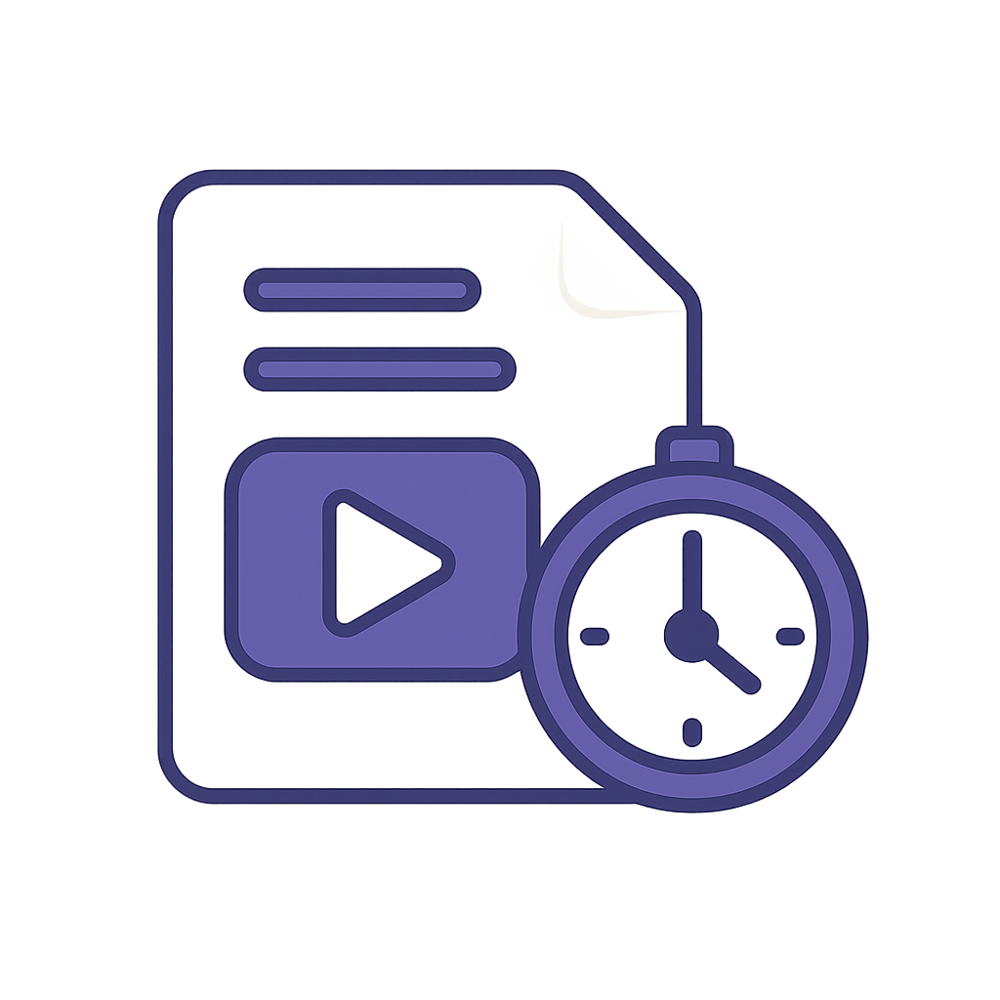

# 🎬 YouTube Video Digest 


[](https://github.com/users/socrabytes/projects/6/views/7)
[](https://opensource.org/licenses/MIT)

Transform YouTube videos into comprehensive, AI-powered summaries using OpenAI's o3-mini. Get the essence of any video without watching the whole thing.

## ✨ Key Features
- 🔄 **Transcript Processing** - Handles transcript extraction and processing
- 🤖 **Generate Digests** - Concise, informative video insights from o3-mini (more coming soon!!!)
- ⏱️ **Chapter Navigation** - Easily navigate videos using extracted timestamp chapter data
- 🗄️ **Database Storage** - Stores video metadata and transcript data in PostgreSQL
- 💰 **Cost Tracking** - Monitors OpenAI token usage and costs (coming soon!!!)
- 📦 **Containerization** - Runs on Docker with Docker Compose

<p align="center"></p>

## 💻 System Architecture

<table>
  <tr>
    <th colspan="2" align="center"><h3>🛠️ Component Overview</h3></th>
  </tr>
  <tr>
    <td width="25%"><strong>Frontend Layer</strong></td>
    <td width="75%">
      <p>Next.js application that provides the user interface for submitting videos and viewing digests</p>
      <p>
        
        
        
        
        
      </p>
    </td>
  </tr>
  <tr>
    <td><strong>API Layer</strong></td>
    <td>
      <p>FastAPI backend that handles HTTP requests, manages background tasks, and controls the application flow</p>
      <p>
        
        
      </p>
    </td>
  </tr>
  <tr>
    <td><strong>Processing Services</strong></td>
    <td>
      <p>Specialized services that extract video metadata, transcripts, and chapter information from YouTube</p>
      <p>
        
      </p>
    </td>
  </tr>
  <tr>
    <td><strong>AI Engine</strong></td>
    <td>
      <p>Integration with OpenAI's o3-mini for generating intelligent video summaries and insights</p>
      <p>
        
      </p>
    </td>
  </tr>
  <tr>
    <td><strong>Data Layer</strong></td>
    <td>
      <p>PostgreSQL database for storing video metadata, transcripts, digests, and user data</p>
      <p>
        
      </p>
    </td>
  </tr>
  <tr>
    <td><strong>Infrastructure</strong></td>
    <td>
      <p>Docker-based containerization for easy deployment and consistent development environments</p>
      <p>
        
        
        
        
      </p>
    </td>
  </tr>
</table>

### 🔄 Processing Flow

<table>
  <tr align="center">
    <td><strong>1. Submit</strong></td>
    <td>→</td>
    <td><strong>2. Validate</strong></td>
    <td>→</td>
    <td><strong>3. Extract</strong></td>
    <td>→</td>
    <td><strong>4. Process</strong></td>
    <td>→</td>
    <td><strong>5. Generate</strong></td>
    <td>→</td>
    <td><strong>6. Store</strong></td>
    <td>→</td>
    <td><strong>7. Display</strong></td>
  </tr>
  <tr align="center">
    <td><small>URL Input</small></td>
    <td></td>
    <td><small>URL Check</small></td>
    <td></td>
    <td><small>Metadata</small></td>
    <td></td>
    <td><small>Transcript</small></td>
    <td></td>
    <td><small>AI Digest</small></td>
    <td></td>
    <td><small>Database</small></td>
    <td></td>
    <td><small>UI View</small></td>
  </tr>
</table>

1. **Input**: User submits a YouTube URL through the Next.js frontend
2. **Validation**: FastAPI backend validates and extracts video information using yt-dlp
3. **Processing**: Background services handle transcript and chapter extraction
4. **AI Generation**: OpenAI o3-mini analyzes the transcript and generates a comprehensive digest
5. **Storage**: All data is stored in PostgreSQL for future retrieval
6. **Presentation**: Frontend displays the digest with interactive timestamps and chapter navigation

## Under the Hood: The Processing Pipeline

This application employs a decoupled, asynchronous architecture to handle potentially long-running tasks like fetching transcripts and generating AI summaries without blocking the user interface.

1.  **Video Submission (`POST /api/v1/videos/`):**
    *   The user submits a YouTube URL.
    *   The FastAPI backend receives the request.
    *   `yt-dlp` is used to quickly validate the URL and extract essential video metadata (title, duration, channel info).
    *   A `Video` record is created in the PostgreSQL database with `processing_status: PENDING`.
    *   A background task (`process_video_background`) is queued to handle transcript fetching.

2.  **Transcript Fetching & Processing (Background Task - `process_video_background` & `TranscriptService`):
    *   The background worker picks up the task.
    *   The `Video` status is updated to `PROCESSING`.
    *   The `TranscriptService` attempts to download the video's transcript using `yt-dlp`.
    *   A `Transcript` record is created.
    *   If successful, the raw transcript data is processed and stored, and the `Transcript` status is set to `PROCESSED`.
    *   The `Video` status is updated to `COMPLETED` (or `FAILED` if transcript fetching fails).

3.  **Digest Request (`POST /api/v1/videos/{video_id}/digests`):
    *   The frontend (or another client) requests a digest for a video.
    *   The API checks if the video exists and has a `PROCESSED` transcript.
    *   A `Digest` record is created in the database, initially with empty content (`content: ""`).
    *   A background task (`generate_digest_background`) is queued, passing the ID of the new `Digest` record.

4.  **AI Summarization (Background Task - `generate_digest_background`):
    *   The background worker picks up the digest generation task.
    *   It retrieves the `Digest`, `Video`, and `Transcript` data from the database.
    *   It selects the appropriate AI summarizer (e.g., `OpenAISummarizer`) based on the request or defaults.
    *   It calls the AI provider's API (e.g., OpenAI) with the transcript content.
    *   Upon receiving the summary, it updates the `Digest` record in the database with the generated `content`, token usage, cost, and model details.

5.  **Retrieval (`GET /api/v1/videos/{video_id}` or `GET /api/v1/digests/{digest_id}`):
    *   The frontend polls or fetches the video/digest details.
    *   The API returns the requested data, including the generated summary once the background task is complete.

This asynchronous approach ensures the application remains responsive, even when dealing with slow external APIs or large transcripts.

## 🚀 Quick Start

### Prerequisites

- Docker and Docker Compose
- OpenAI API key

### Setup

1. Clone the repository:
```bash
git clone https://github.com/socrabytes/youtube-digest.git
cd youtube-digest
```

2. Create environment files:

```bash
# Backend (.env)
OPENAI_API_KEY=your_api_key
DATABASE_URL=postgresql://postgres:postgres@db:5432/youtube_digest

# Frontend (.env.local)
NEXT_PUBLIC_API_URL=http://localhost:8000
```

3. Start the application:
```bash
docker-compose up
```

4. Open [http://localhost:3000](http://localhost:3000) in your browser

### Using the App

1. Enter a YouTube URL in the input field
2. Click "Create Digest"
3. Wait for the AI to process the video
4. View your generated summary

### 🐳 Docker Workflow

This project uses Docker Compose for containerization. Here's the recommended workflow:

1. **Starting containers**:
   ```bash
   docker-compose up      # Start and create containers if they don't exist
   ```

2. **Stopping containers** (preserves data):
   ```bash
   docker-compose stop    # Stop containers without removing them
   ```

3. **Restarting containers**:
   ```bash
   docker-compose start   # Restart previously stopped containers
   ```

4. **Complete teardown** (for rebuilding):
   ```bash
   docker-compose down    # Remove containers, networks, and default volumes
   ```

Only use `docker-compose down` when you need to tear down your environment completely to ensure a clean start, such as after making significant changes to dependencies, Dockerfiles, or for a complete rebuild.

## 📚 Documentation

<table>
  <tr>
    <td width="50%"><strong>Core Documentation</strong></td>
    <td width="50%"><strong>Development Resources</strong></td>
  </tr>
  <tr>
    <td>
      <ul>
        <li><a href="./docs/features/ai-video-summarization.md">Features</a> - Detailed feature explanations</li>
        <li><a href="./docs/patterns/README.md">Development Patterns</a> - Code organization</li>
        <li><a href="./docs/patterns/openai-integration.md">OpenAI Integration</a> - AI implementation</li>
        <li><a href="./docs/patterns/background-tasks.md">Background Tasks</a> - Async processing</li>
        <li><a href="./docs/patterns/transcript-processing.md">Transcript Processing</a> - Video data extraction</li>
      </ul>
    </td>
    <td>
      <ul>
        <li><a href="./docs/workflow/github-projects.md">Project Board</a> - Track development progress</li>
        <li><a href="./docs/tasks/">Tasks</a> - Implementation details for specific features</li>
        <li><a href="https://github.com/users/socrabytes/projects/6/views/7">GitHub Projects</a> - Current sprint and backlog</li>
      </ul>
    </td>
  </tr>
</table>

## 🤝 Contributing

Contributions are welcome! Please follow our [Gitmoji commit convention](./docs/workflow/github-projects.md) and check the project board for current priorities.
