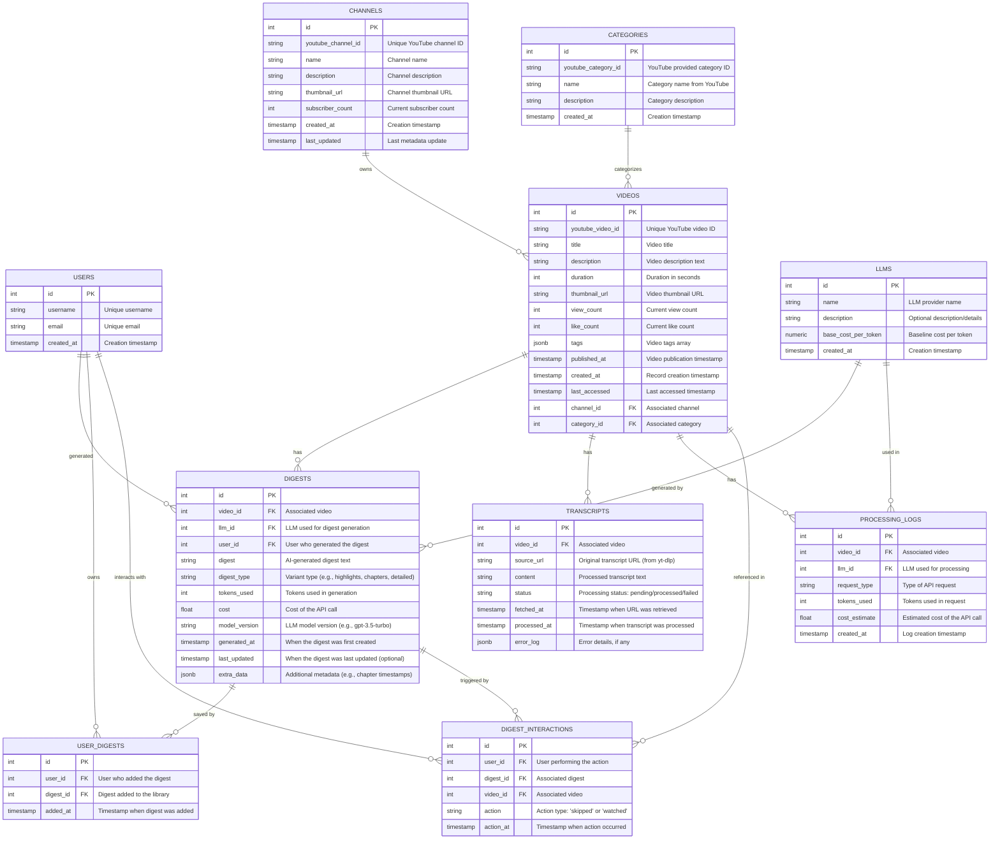

# Database Schema Design

## Overview
This document outlines the database schema for the YouTube Digest application. The schema is designed to support video processing, transcript generation, and digest creation while maintaining data integrity and tracking processing costs.

## Entity Relationship Diagram

## Table Details

### VIDEOS
The central table storing video metadata extracted via yt-dlp. Key fields include:
- `youtube_video_id`: Unique identifier from YouTube
- `title`: Video title
- `description`: Video description text
- `duration`: Video length in seconds
- `view_count`: Current view count from YouTube
- `like_count`: Current like count from YouTube
- `tags`: Array of video tags stored as JSONB
- `channel_id`: Foreign key to CHANNELS
- `category_id`: Foreign key to CATEGORIES

Dynamic fields (`view_count`, `like_count`) are updated through periodic refresh operations using yt-dlp.

### CHANNELS
Stores channel information with fields:
- `youtube_channel_id`: Unique identifier from YouTube
- `name`: Channel name
- `description`: Channel description
- `thumbnail_url`: URL to channel thumbnail
- `subscriber_count`: Current subscriber count (updated periodically)
- `last_updated`: Timestamp of last metadata refresh

The `subscriber_count` field is updated periodically along with other dynamic metrics.

### CATEGORIES
Maps directly to YouTube category data:
- `youtube_category_id`: Original YouTube category identifier
- `name`: Category name as provided by YouTube
- `description`: Category description

Categories are populated from yt-dlp data during video processing.

### TRANSCRIPTS
Stores video transcript data with processing status:
- `id`: Primary key
- `video_id`: Foreign key to associated video
- `source_url`: Original transcript URL (from yt-dlp)
- `content`: Processed transcript text
- `status`: Processing status (pending/processed/failed)
- `fetched_at`: Timestamp when URL was retrieved
- `processed_at`: Timestamp when transcript was processed
- `error_log`: Error details, if any

Transcripts are processed asynchronously after video metadata is retrieved from yt-dlp.

### LLMS
Stores information about Language Learning Models used for digest generation:
- `id`: Primary key
- `name`: LLM provider name
- `description`: Optional description/details
- `base_cost_per_token`: Baseline cost per token
- `created_at`: Creation timestamp

### DIGESTS
Stores AI-generated video digests:
- `id`: Primary key
- `video_id`: Foreign key to associated video
- `llm_id`: Foreign key to LLM used for generation
- `user_id`: Foreign key to user who generated the digest
- `digest`: AI-generated digest text
- `digest_type`: Variant type (e.g., highlights, chapters, detailed)
- `tokens_used`: Tokens used in generation
- `cost`: Cost of the API call
- `model_version`: LLM model version (e.g., gpt-3.5-turbo)
- `generated_at`: When the digest was first created
- `last_updated`: When the digest was last updated (optional)
- `extra_data`: Additional metadata (e.g., chapter timestamps)

### PROCESSING_LOGS
Tracks API usage and costs:
- `id`: Primary key
- `video_id`: Foreign key to associated video
- `llm_id`: Foreign key to LLM used for processing
- `request_type`: Type of API request
- `tokens_used`: Tokens used in request
- `cost_estimate`: Estimated cost of the API call
- `created_at`: Log creation timestamp

### USER_DIGESTS
Maps users to their saved digests:
- `id`: Primary key
- `user_id`: Foreign key to user who added the digest
- `digest_id`: Foreign key to digest added to the library
- `added_at`: Timestamp when digest was added

### DIGEST_INTERACTIONS
Tracks user interactions with digests:
- `id`: Primary key
- `user_id`: Foreign key to user performing the action
- `digest_id`: Foreign key to associated digest
- `video_id`: Foreign key to associated video
- `action`: Action type ('skipped' or 'watched')
- `action_at`: Timestamp when action occurred

### USERS
Stores user information:
- `id`: Primary key
- `username`: Unique username
- `email`: Unique email
- `created_at`: Creation timestamp

### Implementation Notes
1. All timestamp fields use UTC
2. Dynamic fields (view_count, like_count, subscriber_count) are updated through periodic refresh operations
3. Tags are stored as JSONB arrays for flexible querying
4. Appropriate indexes will be created for foreign keys and frequently queried fields
5. Update operations for dynamic fields will use UPSERT to prevent race conditions

## Migration Strategy
The schema will be implemented in phases:
1. Core tables (VIDEOS, CHANNELS, CATEGORIES)
   - Including all yt-dlp derived fields
   - Setting up update mechanisms for dynamic data
2. Transcript processing (TRANSCRIPTS)
3. Digest generation (LLMS, DIGESTS)
4. User interaction (USER_DIGESTS, DIGEST_INTERACTIONS)

Each phase will have its own Alembic migration script, allowing for incremental deployment and testing.
