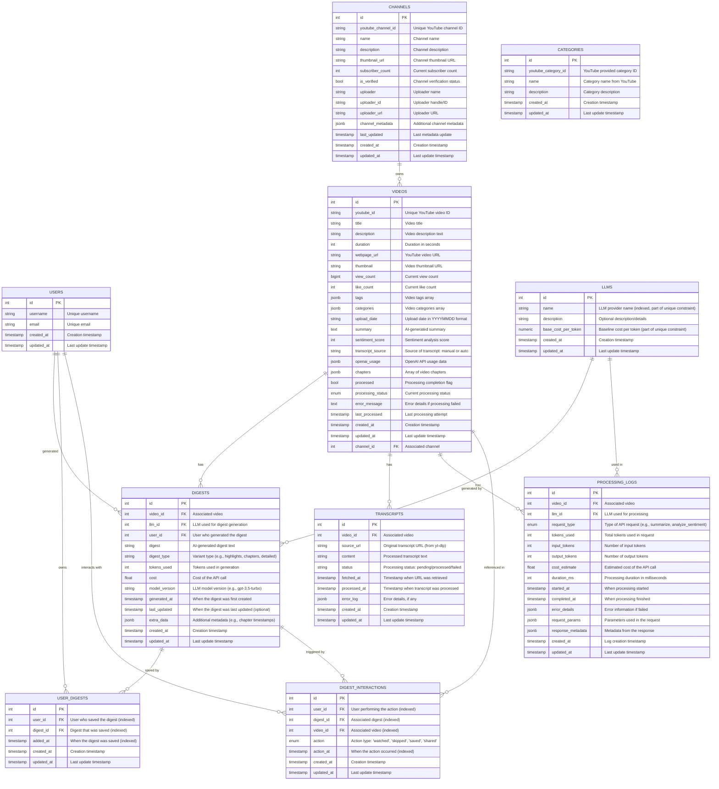

# Database Schema Design

## Overview
This document outlines the database schema for the YouTube Digest application. The schema is designed to support video processing, transcript generation, and digest creation while maintaining data integrity and tracking processing costs.

## Entity Relationship Diagram

## Table Details

### VIDEOS
The central table storing video metadata extracted via yt-dlp. Key fields include:
- `youtube_id`: Unique identifier from YouTube
- `title`: Video title
- `description`: Video description text
- `duration`: Video length in seconds
- `view_count`: Current view count from YouTube
- `like_count`: Current like count from YouTube
- `tags`: Array of video tags stored as JSONB
- `categories`: Array of video categories stored as JSONB
- `channel_id`: Foreign key to CHANNELS
- `summary`: AI-generated summary of video content
- `sentiment_score`: Numerical score from sentiment analysis
- `openai_usage`: Tracking of OpenAI API usage
- `processing_status`: Current state of video processing
- `chapters`: Video chapter information if available

Dynamic fields (`view_count`, `like_count`) are updated through periodic refresh operations using yt-dlp.

### CHANNELS
Stores channel information with fields:
- `youtube_channel_id`: Unique identifier from YouTube
- `name`: Channel name
- `description`: Channel description
- `thumbnail_url`: URL to channel thumbnail
- `subscriber_count`: Current subscriber count (updated periodically)
- `is_verified`: Channel verification status
- `uploader`: Name of the channel owner
- `uploader_id`: YouTube handle or ID
- `uploader_url`: URL to uploader's page
- `channel_metadata`: Additional channel data in JSONB format
- `last_updated`: Timestamp of last metadata refresh

### CATEGORIES
Reference table for YouTube categories:
- `youtube_category_id`: Original YouTube category identifier
- `name`: Category name as provided by YouTube
- `description`: Category description

Note: Categories are stored directly in the videos table as a JSONB array rather than using foreign key relationships. This design:
1. Allows videos to have multiple categories
2. Maintains the exact category data as provided by YouTube
3. Provides more flexibility for category updates
4. Improves query performance by avoiding joins

The categories table serves as a reference/lookup table for category information but does not have direct foreign key relationships with videos.

### TRANSCRIPTS
Stores video transcript data with processing status:
- `id`: Primary key
- `video_id`: Foreign key to associated video
- `source_url`: Original transcript URL (from yt-dlp)
- `content`: Processed transcript text
- `status`: Processing status (pending/processed/failed)
- `fetched_at`: Timestamp when URL was retrieved
- `processed_at`: Timestamp when transcript was processed
- `error_log`: Error details, if any

Transcripts are processed asynchronously after video metadata is retrieved from yt-dlp.

### LLMS
Stores information about Language Learning Models:
- `name`: Model name (e.g., 'gpt-4', 'claude-2')
- `description`: Model capabilities and characteristics
- `base_cost_per_token`: Base cost per token in USD

Note: The combination of `name` and `base_cost_per_token` must be unique, allowing tracking of cost changes over time.

### DIGESTS
Stores AI-generated video digests:
- `id`: Primary key
- `video_id`: Foreign key to associated video
- `llm_id`: Foreign key to LLM used for generation
- `user_id`: Foreign key to user who generated the digest
- `digest`: AI-generated digest text
- `digest_type`: Variant type (e.g., highlights, chapters, detailed)
- `tokens_used`: Tokens used in generation
- `cost`: Cost of the API call
- `model_version`: LLM model version (e.g., gpt-3.5-turbo)
- `generated_at`: When the digest was first created
- `last_updated`: When the digest was last updated (optional)
- `extra_data`: Additional metadata (e.g., chapter timestamps)

### PROCESSING_LOGS
Tracks all LLM processing requests and their outcomes:
- `video_id`: Associated video being processed
- `llm_id`: LLM model used for the request
- `request_type`: Enum of request types (summarize, analyze_sentiment, etc.)
- `tokens_used`: Total tokens consumed
- `input_tokens`: Number of input tokens
- `output_tokens`: Number of output tokens
- `cost_estimate`: Estimated cost in USD
- `duration_ms`: Processing duration in milliseconds
- `started_at`: When processing started
- `completed_at`: When processing finished
- `error_details`: Error information if failed (JSONB)
- `request_params`: Parameters used in the request (JSONB)
- `response_metadata`: Metadata from the response (JSONB)

### USER_DIGESTS
Maps users to their saved digests, enabling personal digest libraries:
- `user_id`: User who saved the digest
- `digest_id`: Digest that was saved
- `added_at`: When the digest was saved
- `created_at`: When the record was created
- `updated_at`: When the record was last updated

The table enforces a unique constraint on (user_id, digest_id) to prevent duplicate saves. All foreign keys have ON DELETE CASCADE to maintain referential integrity. Indexes on user_id, digest_id, and added_at optimize common queries for user libraries and save timelines.

### DIGEST_INTERACTIONS
Tracks user interactions with digests for analytics and personalization:
- `user_id`: User who performed the action
- `digest_id`: Digest being interacted with
- `video_id`: Video associated with the digest
- `action`: Type of interaction (watched, skipped, saved, shared)
- `action_at`: When the interaction occurred
- `created_at`: When the record was created
- `updated_at`: When the record was last updated

All foreign keys have ON DELETE CASCADE to maintain referential integrity. The table includes indexes on all foreign keys and the action_at timestamp to optimize common queries for user activity and interaction timelines.

### USERS
Stores user information:
- `id`: Primary key
- `username`: Unique username
- `email`: Unique email
- `created_at`: Creation timestamp

### Implementation Notes
1. All timestamp fields use UTC
2. Dynamic fields (view_count, like_count, subscriber_count) are updated through periodic refresh operations
3. Tags are stored as JSONB arrays for flexible querying
4. Appropriate indexes will be created for foreign keys and frequently queried fields
5. Update operations for dynamic fields will use UPSERT to prevent race conditions

## Migration Strategy
The schema will be implemented in phases:
1. Core tables (VIDEOS, CHANNELS, CATEGORIES)
   - Including all yt-dlp derived fields
   - Setting up update mechanisms for dynamic data
2. Transcript processing (TRANSCRIPTS)
3. Digest generation (LLMS, DIGESTS)
4. User interaction (USER_DIGESTS, DIGEST_INTERACTIONS)

Each phase will have its own Alembic migration script, allowing for incremental deployment and testing.
